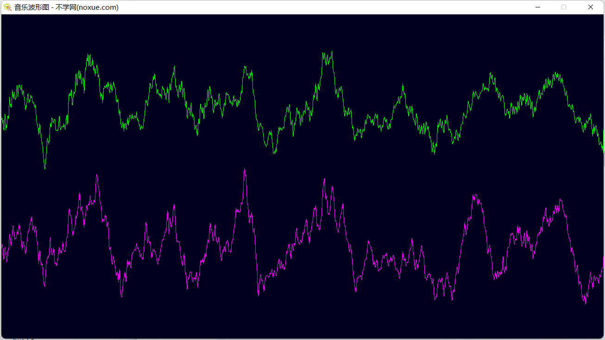

# 功能

播放音乐，显示波形图的测试代码

# 实现

* miniaudio 播放音乐
* sdl2 显示波形图

# 编译

* 编译命令


* 下载sdl（mingw编译不需要下载，已经包含在项目中了）
    - 下载页面：<https://www.libsdl.org/download-2.0.php>  
    - mingw: <https://www.libsdl.org/release/SDL2-devel-2.0.22-mingw.zip>

* 修改cmake/FindSDL2.cmake 中 sdl2 所在路径(注意路径分隔符使用** / **)（mingw编译不需要修改，库已经包含在项目中了）


```shell
mkdir build
cd build
cmake .. -G "MinGW Makefiles"
mingw32-make
```

# 运行程序

将 音乐文件 拖到 程序图标上即可播放


